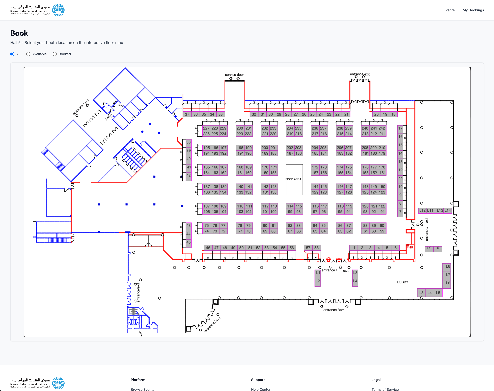

# Kuwait International Fair - Booth Booking System

A modern event booth booking platform built with Laravel 12 and Filament 4, featuring interactive SVG floor maps for intuitive booth selection and management.



## Features

- 🗺️ **Interactive Floor Maps** - Dynamic SVG-based floor plans with real-time booth visualization
- 📅 **Event Management** - Create and manage multiple events with custom dates and statuses
- 🏛️ **Multi-Hall Support** - Each event can span multiple exhibition halls
- 📝 **Booth Submissions** - Anonymous booth booking requests without user authentication
- ✅ **Approval Workflow** - Admin panel for reviewing and approving/rejecting submissions
- 🔒 **SVG Sanitization** - Server-side sanitization of uploaded floor maps for security
- 📱 **Responsive Design** - Built with Tailwind CSS v4 for mobile and desktop

## Quick Start

### Prerequisites

- PHP 8.2 or higher
- Composer
- Node.js & npm

### Installation

```bash
# Clone the repository
git clone <repository-url>
cd KIF-Booking

# Run complete setup (dependencies, env, migrations, assets)
composer setup
```

### Development

```bash
# Start all development services (web server, queue, logs, Vite)
composer dev
```

This starts:

- Laravel development server at `http://localhost:8000`
- Vite dev server with hot module replacement
- Queue worker for background jobs
- Laravel Pail for log streaming

### Running Services Individually

```bash
php artisan serve        # Web server
npm run dev              # Vite dev server
php artisan queue:work   # Queue worker
```

## Architecture

### Public Interface

**Home Page** (`/`) - Event browsing and booth selection

- Displays active events with their exhibition halls
- Interactive SVG floor map with booth selection
- Filter booths by availability status
- Submit booking requests with contact information

### Admin Panel

**Filament Admin** (`/admin`) - Complete management interface

- **Events**: Create/edit events with date ranges and status management
- **Halls**: Upload SVG floor maps and manage exhibition halls
- **Submissions**: Review, approve, or reject booth booking requests
- Bulk actions for efficient submission processing

### Domain Model

```
Event (many-to-many) ↔ Hall
  ↓                      ↓
Submission ←────────────┘

- Events have multiple Halls
- Halls can be used by multiple Events
- Submissions link specific booths to Event/Hall combinations
- Booths are SVG elements (not database records)
```

## Technology Stack

- **Backend**: Laravel 12 with PHP 8.2+
- **Admin Panel**: Filament 4
- **Frontend**: Tailwind CSS v4 + Vite
- **Database**: SQLite (default) with database-backed queues/cache
- **Testing**: Pest PHP
- **Media Storage**: Spatie Laravel MediaLibrary
- **Code Quality**: Laravel Pint

## Database

Default configuration uses SQLite for simplicity. Change database settings in `.env` as needed.

```bash
php artisan migrate              # Run migrations
php artisan migrate:fresh        # Fresh start
php artisan migrate:fresh --seed # With seed data
```

## Code Quality

```bash
./vendor/bin/pint        # Format code
./vendor/bin/pint --test # Check formatting
```

## Key Features Explained

### Interactive Floor Maps

Floor maps are SVG files uploaded through the Filament admin panel. The system:

1. Sanitizes uploaded SVGs server-side to prevent XSS attacks
2. Stores them via Spatie MediaLibrary
3. Dynamically loads them on the public interface
4. Makes booth elements (SVG `<g>` tags) interactive with JavaScript
5. Booth IDs come directly from SVG element `id` attributes

**SVG Structure Requirements:**

- Interactive booth elements must be grouped under `g#Floor Map`
- Each booth should be a `<g>` element with a unique `id` attribute

### Submission Workflow

1. **User selects booth** on interactive floor map
2. **Fills contact form** with phone, email (optional), company name (optional)
3. **Submission created** with "pending" status
4. **Admin reviews** in Filament panel
5. **Bulk approve/reject** submissions or handle individually

### Event Scheduling

Events have date ranges and can be assigned to multiple halls. The system validates:

- Hall scheduling conflicts (no double-booking)
- Event date ranges (end date must be after start date)
- Minimum date constraints (events must start in the future)

## Project Structure

```
app/
├── Filament/
│   └── Resources/
│       ├── Events/          # Event management
│       ├── Halls/           # Hall management
│       └── Submissions/     # Submission management
│           ├── SubmissionResource.php
│           ├── Tables/SubmissionsTable.php
│           └── Schemas/SubmissionForm.php
├── Http/Controllers/
│   └── HomeController.php   # Public interface
├── Models/
│   ├── Event.php
│   ├── Hall.php
│   └── Submission.php
resources/
├── views/
│   └── pages/
│       └── home.blade.php   # Public event browsing
├── css/
│   └── app.css              # Tailwind CSS v4
└── js/
    └── app.js
```

## Environment Configuration

Copy `.env.example` to `.env` and configure:

- `APP_NAME` - Application name
- `APP_URL` - Base URL
- `DB_CONNECTION` - Database driver (default: sqlite)
- `QUEUE_CONNECTION` - Queue driver (default: database)
- `MAIL_*` - Email settings (default: log)

## Contributing

1. Follow PSR-12 coding standards (enforced by Laravel Pint)
2. Write tests using Pest PHP
3. Use Filament 4 conventions for admin resources
4. Keep SVG files sanitized and secure

## License

The Laravel framework is open-sourced software licensed under the [MIT license](https://opensource.org/licenses/MIT).

## Support

For issues and feature requests, please use the project's issue tracker.
